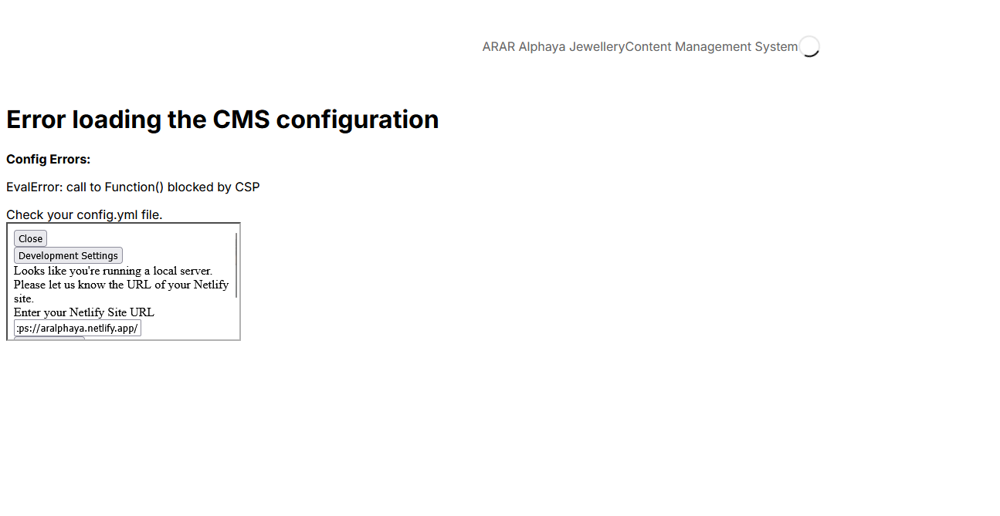

STEP 1 ERROR

Content-Security-Policy warnings 2
Content-Security-Policy: Ignoring “'unsafe-inline'” within script-src: nonce-source or hash-source specified localhost:3000
Content-Security-Policy: Ignoring “'unsafe-inline'” within style-src: nonce-source or hash-source specified localhost:3000
Content-Security-Policy: The page’s settings blocked an inline style (style-src-attr) from being applied because it violates the following directive: “style-src 'self' 'nonce-R05exQD0H693YgEQCvrzHA==' 'unsafe-inline' https://fonts.googleapis.com”. Consider using a hash ('sha256-zlqnbDt84zf1iSefLU/ImC54isoprH/MRiVZGskwexk=', requires 'unsafe-hashes' for style attributes) or a nonce.
Source: color:transparent 3 localhost:3000
Uncaught EvalError: call to eval() blocked by CSP
    NextJS 7
main-app.js:1139:1
Content-Security-Policy: The page’s settings blocked a JavaScript eval (script-src) from being executed because it violates the following directive: “script-src 'self' 'nonce-R05exQD0H693YgEQCvrzHA==' 'unsafe-inline' https://*.auth0.com https://www.payhere.lk https://identity.netlify.com https://unpkg.com” (Missing 'unsafe-eval') main-app.js:1139:1
The resource at “https://unpkg.com/netlify-identity-widget@1.9.2/build/netlify-identity-widget.js” preloaded with link preload was not used within a few seconds. Make sure all attributes of the preload tag are set correctly. localhost:3000

​STEP 3 ERROR

CMS not in http://localhost:3000/admin but in http://localhost:3000/admin/index.html

OPTION A for uploadcare